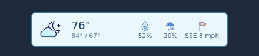
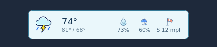

# Homepage NWS Weather


<p align="center">
  
  
</p>

A compact [Homepage](https://gethomepage.dev/) header widget backed by the official US National Weather Service API.

It shows the current temperature, the next high/low pair, current forecast conditions, humidity, precipitation probability, and wind. It requires no account or API key and serves its artwork locally.

## Features

- Official NWS forecast data from `api.weather.gov`
- No API key, proxy service, or third-party weather account
- Automatic latitude/longitude to NWS grid discovery
- Cached grid metadata and forecast data for quick reloads
- One self-hosted PNG sprite with day, night, cloud, precipitation, and metric artwork
- Flat, responsive styling designed for Homepage's header
- Configurable placement, colors, units, refresh timing, and DOM target
- Graceful cached fallback when the NWS endpoint is temporarily slow or unavailable

## Requirements

- A recent Homepage release with [`custom.js` support](https://gethomepage.dev/configs/custom-css-js/)
- A location covered by the US National Weather Service
- Latitude and longitude for that location
- Browser access to `https://api.weather.gov`

## Installation

### 1. Copy the two runtime files

Copy these files into your Homepage config directory:

```text
nws-weather.js
weather-icons.png
```

For example:

```sh
cp nws-weather.js weather-icons.png /path/to/homepage/config/
```

### 2. Expose them as static files

Homepage only exposes designated files from `/app/config`, so add two read-only mounts to the Homepage service:

```yaml
services:
  homepage:
    volumes:
      - /path/to/homepage/config:/app/config
      - /path/to/homepage/config/nws-weather.js:/app/public/nws-weather.js:ro
      - /path/to/homepage/config/weather-icons.png:/app/public/weather-icons.png:ro
```

A complete example is in [`examples/compose.yaml`](examples/compose.yaml).

### 3. Load it from `custom.js`

Add this after any existing code in your Homepage `custom.js`, replacing the example coordinates:

```js
window.HOMEPAGE_NWS_WEATHER = {
  latitude: 39.7456,
  longitude: -97.0892,
  locationLabel: "Home",
};

(() => {
  if (document.querySelector('script[data-homepage-nws-weather]')) return;

  const script = document.createElement("script");
  script.src = "/nws-weather.js?v=0.1.3";
  script.defer = true;
  script.dataset.homepageNwsWeather = "true";
  document.head.appendChild(script);
})();
```

See [`examples/custom.js`](examples/custom.js) for the same loader as a standalone file.

### 4. Recreate Homepage

```sh
docker compose up -d --force-recreate homepage
```

Refresh Homepage. The widget is inserted before the right-aligned date/time widget and centered in the available space by default.

## Configuration

Set `window.HOMEPAGE_NWS_WEATHER` before loading `nws-weather.js`.

| Option | Default | Description |
| --- | --- | --- |
| `latitude` | required | Latitude from `-90` to `90` |
| `longitude` | required | Longitude from `-180` to `180` |
| `locationLabel` | NWS city/state | Accessible location label and loading text |
| `units` | `"us"` | NWS unit system: `"us"` or `"si"` |
| `position` | `"center"` | Placement inside the target: `"start"`, `"center"`, or `"end"` |
| `targetSelector` | `"#information-widgets-right"` | Element that receives the widget |
| `linkTarget` | `"_blank"` | Target used when opening the detailed NWS forecast |
| `background` | `"#eaf7fb"` | Widget background color |
| `border` | `"#367b98"` | Widget border and focus color |
| `text` | `"#173652"` | Widget text color |
| `refreshMinutes` | `30` | Successful forecast refresh interval; minimum 5 minutes |
| `retryMinutes` | `5` | Retry interval after a failed request; minimum 1 minute |
| `requestTimeoutSeconds` | `75` | Per-request timeout; minimum 5 seconds |
| `endpointCacheDays` | `7` | NWS grid metadata lifetime; minimum 1 day |
| `weatherCacheMinutes` | `360` | Maximum forecast cache age; minimum 15 minutes |
| `spriteUrl` | next to the script | Alternate icon sprite URL |
| `detailsUrl` | generated from coordinates | Alternate click-through URL |
| `forecastUrl` | discovered from NWS | Advanced override for testing or a fixed grid |
| `hourlyUrl` | discovered from NWS | Advanced override for testing or a fixed grid |

Example with custom colors:

```js
window.HOMEPAGE_NWS_WEATHER = {
  latitude: 39.7456,
  longitude: -97.0892,
  locationLabel: "Home",
  position: "center",
  background: "#edf8fb",
  border: "#2f7896",
  text: "#173652",
};
```

## How caching works

The browser stores two small JSON entries in `localStorage`:

- The NWS grid endpoints are refreshed weekly. NWS recommends periodically refreshing them because an office or grid assignment can occasionally change.
- A successful forecast is cached for up to six hours by default and appears immediately on reload while fresh data is requested.

If a refresh fails, the last valid cached forecast remains visible and the widget retries quietly.

## Local demo

The repository has a dependency-free demo using local forecast fixtures:

```sh
python3 -m http.server 8088
```

Then open `http://localhost:8088/demo/`.

## Sprite maintenance

The icon sheet is a 4-by-3 grid. If its artwork changes, normalize every icon's visible vertical bounds with the dependency-free maintenance script:

```sh
python3 tools/normalize_sprite.py weather-icons.png weather-icons.png
```

The operation is idempotent, so a second pass reports zero movement for every cell.

## Troubleshooting

**Nothing appears**

- Confirm both files return HTTP 200 at `/nws-weather.js` and `/weather-icons.png`.
- Check that the configuration is defined before the loader runs.
- Recreate the Homepage container after adding new bind mounts.
- Look for messages prefixed with `homepage-nws-weather` in the browser console.

**The widget says “Forecast unavailable”**

- Confirm the coordinates are inside NWS coverage.
- Confirm the browser—not only the Homepage container—can reach `api.weather.gov` over HTTPS.
- NWS responses can occasionally be slow; the default request timeout is intentionally 75 seconds.

**Changes do not appear**

- Increment the query string on `/nws-weather.js?v=...` to bypass browser cache.

## Project notes

This is an unofficial community add-on and is not affiliated with Homepage, NOAA, or the National Weather Service. Forecast data comes from the [NWS API](https://www.weather.gov/documentation/services-web-API). The included weather sprite is original artwork created for this project.

## License

[MIT](LICENSE)
