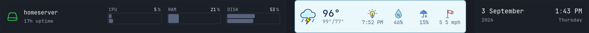
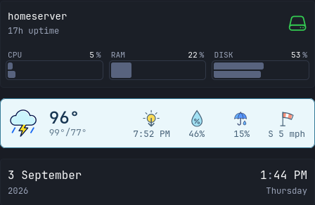

# Glance custom API widget

This is a Glance `custom-api` port of Homepage NWS Weather. It keeps the weather data on the official NWS API and reproduces the compact temperature, high/low, humidity, precipitation, wind, and next sunrise/sunset display.

## Preview



<p align="center">
  
</p>

## Requirements

- Glance v0.8.0 or newer
- A US location covered by the National Weather Service
- Network access from the Glance container to `api.weather.gov`

## Installation

1. Copy `nws-weather.yml` into the directory containing your Glance configuration.
2. Copy the repository's `weather-icons.png` and `glance/nws-weather.js` into the directory exposed by Glance as `/assets/`. Name the JavaScript file `glance-nws-weather.js` there.
3. Give the Glance container `NWS_LATITUDE` and `NWS_LONGITUDE` environment variables.
4. Include the widget in a page's `head-widgets` or one of its columns.

Example Docker Compose configuration:

```yaml
services:
  glance:
    environment:
      NWS_LATITUDE: "39.7456"
      NWS_LONGITUDE: "-97.0892"
    volumes:
      - ./config:/app/config
      - ./assets:/app/assets:ro
```

Point Glance at the assets directory if it is not already configured:

```yaml
server:
  assets-path: /app/assets
```

Load the small solar-time helper from Glance's document head:

```yaml
document:
  head: |
    <script src="assets/glance-nws-weather.js" defer></script>
```

Then include the widget. A head widget most closely matches the original Homepage placement:

```yaml
pages:
  - name: Home
    head-widgets:
      - $include: nws-weather.yml
    columns:
      # ...
```

Glance automatically reloads the configuration after `nws-weather.yml` changes. Environment-variable changes require restarting Glance.

### Optional three-widget top row

To place server uptime, weather, and a clock together, use Glance's native `split-column` widget:

```yaml
pages:
  - name: Home
    head-widgets:
      - type: split-column
        css-class: home-top-row
        max-columns: 3
        widgets:
          - type: server-stats
            hide-header: true
            servers:
              - type: local
                name: homeserver
          - $include: nws-weather.yml
          - type: clock
            hide-header: true
            hour-format: 12h
```

Append [`top-row.css`](top-row.css) to the custom CSS file configured by your Glance theme. Its three variables control the desktop width shares:

```css
--uptime-width: 5;
--weather-width: 3;
--clock-width: 2;
```

The same small stylesheet makes the three desktop cards equal in height. Glance retains its normal stacked, content-sized layout on narrow screens.

## Options

The `options` block in `nws-weather.yml` supports:

| Option | Default | Description |
| --- | --- | --- |
| `latitude` | `${NWS_LATITUDE}` | Latitude used for point lookup, the forecast link, and solar calculation |
| `longitude` | `${NWS_LONGITUDE}` | Longitude used for point lookup, the forecast link, and solar calculation |
| `location-label` | `Home` | Accessible location name; set to an empty string to use the NWS city/state |
| `units` | `us` | NWS unit system: `us` or `si` |
| `sprite-url` | `assets/weather-icons.png` | URL of the locally served icon sheet; the relative path also works with Glance's `base-url` setting |
| `background` | `#eaf7fb` | Widget background color |
| `border` | `#367b98` | Widget border and focus color |
| `text` | `#173652` | Widget text and line-art color |

The successful response is cached by Glance for 30 minutes. The NWS point lookup, forecast, and hourly forecast are fetched server-side, so browser CORS access is not required. When a discovered forecast request fails, the template deliberately fails its update so Glance can retain the last successful render and retry early.

Coordinates are normalized to the four decimal places accepted by the NWS point endpoint. Integer and higher-precision decimal environment-variable values are both supported.

The solar time is calculated by `nws-weather.js` in the browser from the configured coordinates and the time zone returned by NWS. This is the only client-side portion of the widget because Glance's custom template functions do not provide the trigonometric operations required by the calculation. The helper watches for Glance's asynchronously loaded page content, so a normal deferred script is sufficient.

## Limitations

- Glance's HTTP client currently has a five-second timeout, which cannot be changed per `custom-api` widget. The point, forecast, and hourly requests are sequential, so a cold request can take up to roughly 15 seconds before failing. A slow NWS response may show an error on the first load or leave previously cached content in place.
- The NWS `/points` endpoint is requested on every cache refresh. Unlike the Homepage version, a custom API template cannot give the point metadata and forecast data separate cache lifetimes.
- Glance only refreshes widget data when a page request finds the cache expired. An already-open page does not receive new weather data automatically, though its sunrise/sunset value changes at the event time.
